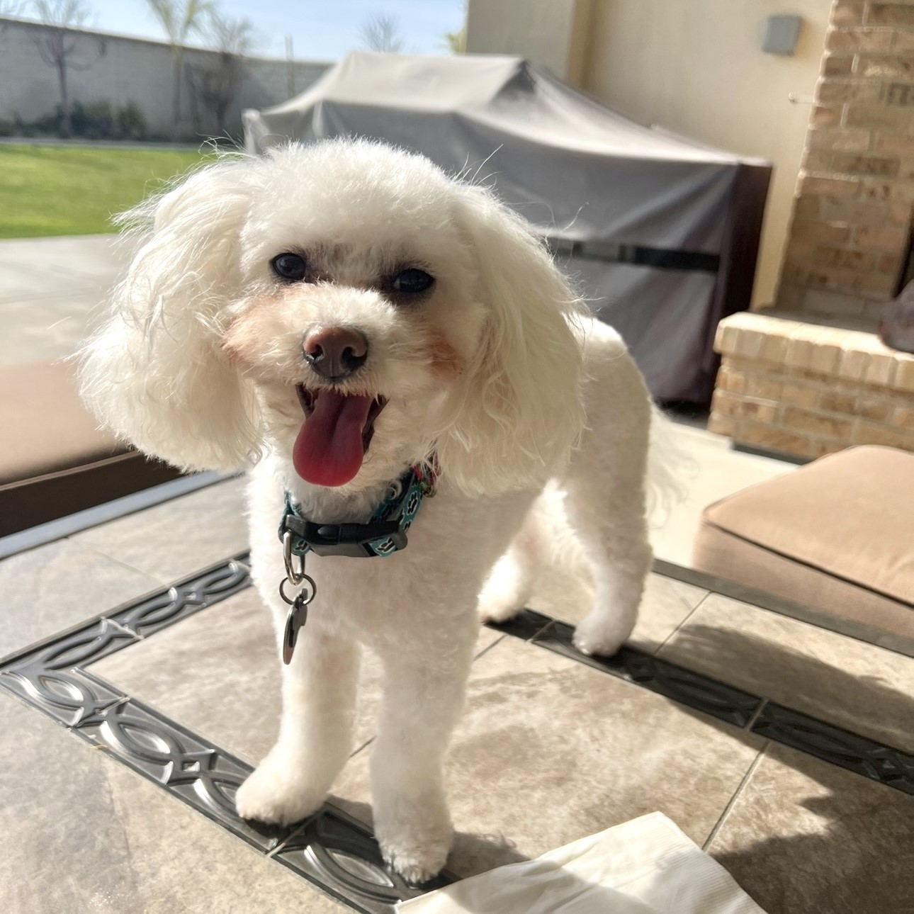

## Table of Contents
1. [Naina Singh](#Naina-Singh)
2. [Background](#Background)
3. [Hobbies](#Hobbies)
4. [Favorites](#Favorites)
5. [Skills/Experience](#Skills-and-Experience)

# Naina Singh 


---
## All About Me!

---
### Background 
🪯

- A Sikh Punjabi woman
- Name: pronounced nan-uh (like the nana in banana!)
- Age: 20
- **I am a second year CS major in Muir**
- I am hoping to learn more in this course to help me in my future endeavors

---
### Hobbies 
👩‍🎨 *besides programming duhh*

- hiking / exploring sd
- trying new foods
- drawing / animation
- reading
- playing video games

---
### Favorites 
🩷
- color: pink
- food: korean BBQ
- dessert: tiramisu
- book: *Between Shades of Grey* by Ruta Septys
- show: Kim's Convenience
- movie: Bullet Train
- travel spot: Dubai
- game: Beyond Two Souls
- music: take a look at my [spotify](https://open.spotify.com/user/naina2oo4ns?si=ec2d2627eed64b09)!

Favorite Code Snippet:
`System.out.println("Hello, World!");`

~~I am just kidding~~

Favorite commands:
```
cd
ls
grep
pwd
cat
find
```
---
### Skills and Experience 
💻

- although I have yet to gain more work experience, here's what I have to offer!
- I am interning this summer!!

Click here for my [LinkedIn](www.linkedin.com/in/nainasingh0004)

Projects
1. USC Summer Program (4 projects in the span of 4 weeks): [portfolio website](https://sites.google.com/view/groupateam1/home)
2. ACM Projects: [STritons](https://docs.google.com/presentation/d/1iqwashESNX4vQBqEDM9jUYjIFV4_UeoX_j7lsov-YoM/edit?usp=sharing)
3. CSE 105: [DFA --> NFA](https://github.com/n2singh/CSE_105_Project)

Classes Taken:
- [x] CSE 8A
- [x] CSE 8B
- [x] CSE 12
- [x] CSE 15L
- [x] CSE 20
- [x] CSE 21
- [x] CSE 30
- [x] CSE 100
- [ ] CSE 101
- [ ] CSE 103
- [x] CSE 105
- [ ] CSE 106
- [ ] CSE 107
- [ ] CSE 109
- [ ] CSE 110 (in progress!)

etc.

---

> a picture of my dog mocha for fun :)



---

> secret image shhhhhh


(a secret relative link)[]


